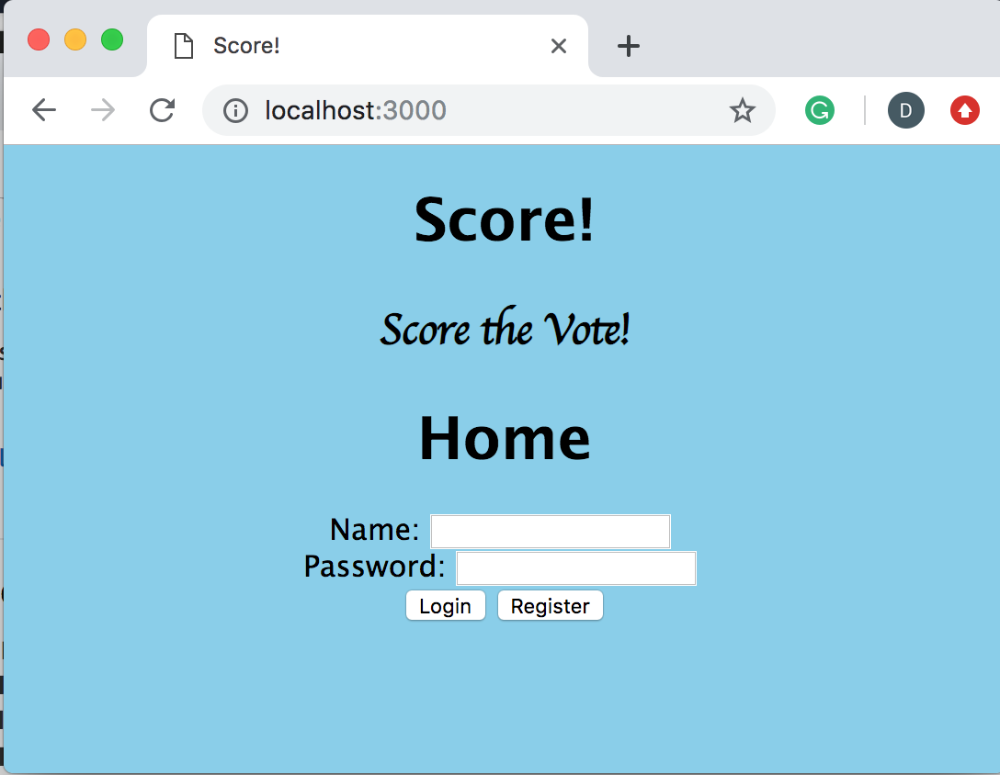

# Score! 

## Overview

It's election time and you have to vote for the next president of your student government. Alice of the Apple Party is alright but she is not your favorite. You also hate Bob of the Bird Party. You like Carol of the Cat Party but you are worried she might take votes away from Alice and allow the divisive candidate Bob to win. You can only vote for one. What are you to do? 

No need to worry with Score!, the voting web app that allows voters to vote without worrying about spoilers or divisive winners. No longer are you forced to vote for one candidate. You can now give each candidate a rating from 0 - 10. Voters can simply register on the app to give each candidate a rating. The candidates with the highest average score rating wins!


## Data Model

The application will store Voters, Candidates, and Elections

An Example Voter:

```javascript
{
  name: "Dan",
  hash: "IStillLikeIke42!",// a password hash,
  _id: 24, //unique voter id, randomly generated for each election
}
```

An Example Candidate

```javascript
{
  name: "Erin",
  party: "Orange Party", 
  _id: 1, //unique id for candidate
  electionid: 52 //unique id for election candidate is running in  
  votes: [3, 1],
}
```

An Example Election

```javascript
{
  position: "President",
  electionid: "1" //unique id for election, 
  candidates: [Candidate],
  voters: [
    { voterid: 24},
    { voterid: 6},
  ],
  
}
```

## [Link to Commented First Draft Schema](/src/db.js) 

## Wireframes

/home/ - page for to login or register


## Site map

home/login -> register \
	|              
	-> elections -> create election -> (goes back to elections)
		|
         vote in election -> (goes back to elections)
					
## User Stories/Use Cases

1. As a non-registered user, I can register a new account to become a registered voter.
2. As a registered user, I can log in to the site.
3. As a registered user, I can create an election.
4. As a registered user, I can give ratings to each candidate in an election.


## Research Topics

* (5 points) Automated functional testing for routes.
* (3 points) Perform client side form validation using custom JavaScript or JavaScript library

## [Link to Initial Main Project File](/src/app.js) 

## Annotations / References Used

